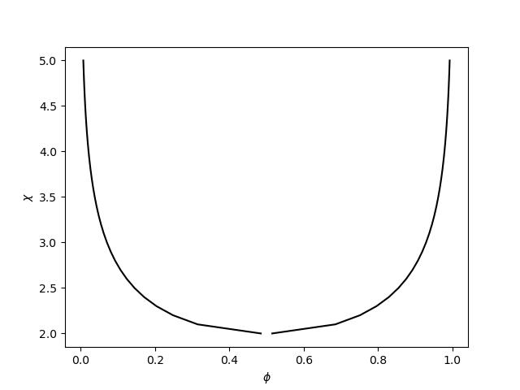

# Summary

Phase separation is an intrinsic property of mixtures that is widely observed in many scenarios, ranging from the simple demixing of oil and water to the condensation of biomolecules in cells.
In multicomponent mixtures, phase separation can lead to many coexisting phases, which is crucial in many fields.
One key step to understand phase separation is to measure or predict the composition of the coexisting phases.
To support such research, the `flory` package provides an easily accessible, performant, and extensible code that finds coexisting phases in multicomponent mixtures.
The package expresses the free energy of the mixtures by several orthogonal aspects to cover a broad range of physical situations.
In contrast to existing methods, the `flory` package implements a state-of-art method that is optimized for mixtures of many components.
The package mainly focus on the mixtures with uniform and relatively simple free energies such as Flory-Huggins free energy and its generalizations, while more complicated ones can also be supported through extensions.

# Statement of need

Finding coexisting phases is a common task in many fields, such as chemical engineering [@lukas2007Computational] and soft matter physics [@jacobs2023Theory].
In general, the coexisting phases can be theoretically predicted by solving the balance equations between phases [@zwicker2022Evolved], or equivalently minimizing the total free energy of the whole mixture [@lukas2007Computational].
Other strategies include direct spatially-resolved simulations [@shrinivas2021Phase] and the construction of the convex hull of the free energy landscape [@mao2019Phase].
There are a few open-source packages that implement these strategies.
Most notably, Calphad packages, including `Equilipy` [@kwon2024Equilipy], `pycalphad` [@otis2017Pycalphad] and `OpenCalphad` [@sundman2015Implementation], combine a database of candidate phases and several strategies above to compute phase diagrams of mixtures with few components.
In addition, `SurfinPy` [@tse2022SurfinPy] applies the free energy minimization strategy to surface phases.

Despite of the multiple useful strategies and packages above, finding coexisting phases is still challenging when the number of the components $N_\mathrm{C}$ in the mixture is large.
The reason is that with larger $N_\mathrm{C}$, the degree of freedom increases (e.g. composition of the phases), leading to the problem of global minimization or sampling in high-dimensional space.
For example, the convex hull strategy needs to sample the entire free energy landscape.
Although it is very efficient for constructing phase diagrams with few components, the computational cost of sampling increases exponentially with $N_\mathrm{C}$.
To our knowledge, the existing Calphad packages also do not focus on the mixtures with many components.
Instead, they are designed to have high flexibility on the free energies of candidate phases.
Therefore, the `flory` Python package tries to fill this gap.
Compared with the existing Calphad packages, `flory` package focuses on the cases when all the candidate phases share the same free energy function.
It assumes that the free energy function takes a rather simple form such as Flory-Huggins free energy, which is usually not included in previous packages.
The value of the Flory-Huggins parameters can either be obtained from database such as `3PDB` [@Polymera] for realistic polymer mixtures, or freely chosen for theoretical purpose.
The package then implements its algorithm based on this assumption, and makes use of the physical information of the free energy to explore the high-dimensional free energy landscape efficiently.
As the result, the `flory` package can determine coexisting phases in a range of multicomponent mixtures while also being efficient enough when the number of the components $N_\mathrm{C}$ is large.

# Methods

The `flory` package is based on the free energy minimization strategy.
To reduce computation cost, the package focuses on coexisting phases in thermodynamically large systems, where the interfaces between phases become negligible.
Coexisting phases can thus be found by minimizing the average free energy density $\bar f$ of the entire system, which is given by

$$\bar{f}({N_\mathrm{P}}, \{J_p\}, \{\phi_{p,i}\}) = \sum_{p=1}^{{N_\mathrm{P}}} J_p f(\{\phi_{p,i}\}) \; ,$$

where $N_\mathrm{C}$ is the number of components, $N_\mathrm{P}$ is the number of phases, $J_p$ denotes the fraction of volume that phase $p=1,\ldots,N_\mathrm{P}$ occupies in the entire system, and $\phi_{p,i}$ is the volume fraction of component $i=1,\ldots,N_\mathrm{C}$ in phase $p$.
The physical behavior of the mixture is encoded in the free energy density $f$, which `flory` expresses using four orthogonal aspects: interaction, entropy, ensemble, and constraints.
The package only imposes limits on the entropy part, which is crucial for the core algorithm, while the other three aspects are rather flexible.
By combining these four aspects, `flory` supports a broad range of free energy densities $f$ with different ensembles and constraints.
A few widely-used specializations are provided for all four aspects, while customized ones can be added easily.

The `flory` package is designed to deliver high performance.
The core part of the `flory` package is the finder for coexisting phases, which can be reused when the number $N_\mathrm{C}$ of components is kept fixed.
This design moves a significant overhead to the creation of the solver, which can be amortized in many tasks, e.g., when a phase diagram is sampled.
The core methods in the finder are just-in-time (JIT) compiled using numba [@lam2015Numba] to achieve high performance.
To support different forms of the free energy $f$, the core method is also designed to be general.
The finder fetches compiled instances of the interaction, entropy, ensemble, and constraints, where case-specific codes are inserted as methods.
These methods are also compiled for performance, using the experimental `jitclass` feature from numba [@lam2015Numba].

The `flory` package adopts state-of-the-art numerical methods to determine coexisting phases.
The main idea is to represent the system by many independent compartments, which can exchange particles and volumes, obeying total constraints [@zwicker2022Evolved].
The `flory` package then minimizes the full free energy $\bar f$ instead of directly solving the corresponding coexistence conditions.
At the free energy minimum, compartments may share similar compositions, which the package then cluster to obtain unique phases using the `scipy` cluster methods [@virtanen2020SciPy].
This strategy circumvents the typical challenge of multiple local minima and it avoids iterating over all possible phase counts $N_\mathrm{P}$.
To improve performance, the `flory` package implements the improved Gibbs ensemble method we developed recently [@qiang2024Scaling].
This method redistributes components across all compartments simultaneously, guided by a set of conjugate variables, such that the total computation cost per step only scales linearly with the number of compartments.
Beside the core function of finding coexisting phases, `flory` also includes convenience tools, e.g., to analyze thermodynamic properties such as chemical potentials and osmotic pressures.
In summary, the `flory` package can typically obtain the equilibrium coexisting states even in systems with many interacting components.

# Examples

The following code illustrates the main functionality of the package by finding the two coexisting phases of a symmetric Flory-Huggins binary mixture with $\chi=4$:

```python
fh = flory.FloryHuggins(2, chis=[[0, 4.0], [4.0, 0]])
ensemble = flory.CanonicalEnsemble(2, phi_means=[0.5, 0.5])
finder = flory.CoexistingPhasesFinder(fh.interaction, fh.entropy, ensemble)
phases = finder.run().get_clusters()
```

Here, `FloryHuggins` represents the seminal Flory-Huggins free energy that creates the interaction `FloryHugginsInteraction` and the entropy `IdealGasEntropy` simultaneously, and provides tools for analyzing coexisting phases.
By updating the interaction, we can then obtain the coexisting phases of another symmetric binary mixture with $\chi=3.5$:

```python
fh.chis = [[0, 3.5], [3.5, 0]]
finder.set_interaction(fh.interaction)
phases = finder.run().get_clusters()
```

This procedure can be repeated to sample an entire phase diagrams.
For example, the following code will generate the phase diagram of a mixture of two components with same molecule sizes,

```python
import matplotlib.pyplot as plt
import numpy as np
import flory

fh = flory.FloryHuggins(2, chis=[[0, 5.0], [5.0, 0]])
ensemble = flory.CanonicalEnsemble(2, phi_means=[0.5, 0.5])
finder = flory.CoexistingPhasesFinder(fh.interaction, fh.entropy, ensemble)

line_chi = []
line_l = []
line_h = []
for chi in np.arange(5.0, 1.0, -0.1):  # scan chi from high value to low value
    fh.interaction.chis = [[0, chi], [chi, 0]]  # set chi matrix of the finder
    finder.set_interaction(fh.interaction)
    phases = finder.run().get_clusters()  # get coexisting phases
    if phases.fractions.shape[0] == 1:  # stop scanning if no phase separation
        break
    line_chi.append(chi)
    line_l.append(phases.fractions[1, 0])
    line_h.append(phases.fractions[0, 0])

plt.plot(line_l, line_chi, c="black")
plt.plot(line_h, line_chi, c="black")
plt.xlabel("$\\phi$")
plt.ylabel("$\\chi$")
plt.show()
```



Moreover, we could vary the type of interaction by initializing a different class or modifying the existing one, and we could similarly change the entropy, ensemble, and constraints.
Customized specialization of all four aspects can be easily implemented by deriving from the provided base classes.

# Acknowledgements

We thank Chengjie Luo for stimulating discussions.
We gratefully acknowledge funding from the Max Planck Society and the European Union (ERC, EmulSim, 101044662).

# References
